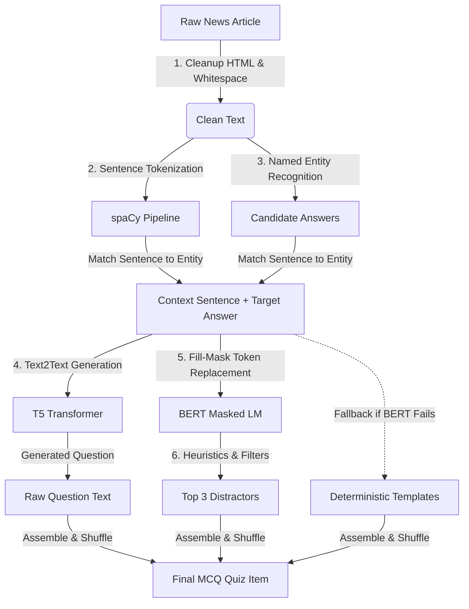

# 🧠 AI Models & NLP Quiz Generation Pipeline

The Quiz Platform relies on a state-of-the-art Natural Language Processing (NLP) and Generative AI pipeline to process fetched news articles, perform semantic extraction, and dynamically generate high-quality, contextual multiple-choice questions (MCQs).

This documentation outlines the models used, how they are integrated, the prompt design, post-processing heuristics, and resource optimizations implemented to run deep learning transformers on a lightweight AWS server.

---

## 🗺️ Architectural Flow

The entire AI processing workflow runs asynchronously inside a **Celery Worker** backed by a **FastAPI** trigger. The diagram below illustrates how a raw news article is transformed into a set of 5 MCQ items:



---

## 🛠️ Step-by-Step AI Model Breakdown

### 1. Text Preprocessing & Entity Extraction (spaCy)
The platform uses the lightweight NLP library **spaCy** to parse the article structure and extract candidate answers.

* **Model Used**: `en_core_web_sm` (English multi-task CNN trained on news/web datasets).
* **Automatic Setup**: Instantiated via a singleton class [NLPPipeline](file:///d:/New_project/ml_models/nlp_pipeline.py#L6-L15). If the model files are not found locally, the engine downloads them programmatically using `spacy.cli.download`.
* **Execution Details**:
  1. **HTML Cleanup**: Raw text is cleaned using regular expressions to strip out HTML tags and collapse duplicate whitespaces into a single space.
  2. **Sentence Segmentation**: Text is segmented into sentences. To ensure the context contains enough semantic information for a high-quality question, sentences shorter than **20 characters** are discarded.
  3. **Named Entity Recognition (NER)**: spaCy identifies named entities. We filter for specific entity types that make factually interesting quiz questions:
     * `PERSON`: Historical or current figures.
     * `ORG`: Corporations, agencies, and academic/government institutions.
     * `GPE`: Geopolitical entities (countries, cities, states).
     * `LOC`: Non-geopolitical locations (rivers, mountain ranges, regions).
     * `DATE`: Specific absolute or relative calendar dates or periods.
     * `EVENT`: Named hurricanes, wars, sports events, etc.
     * `WORK_OF_ART`: Book/song/movie titles, laws, etc.
  4. **Pairing**: The extracted entities are treated as **target correct answers**, and the sentences they appeared in are mapped as their containing **contexts**.

---

### 2. Question Generation (T5 Transformer)
Once a context sentence and a target answer are identified, they are formatted and passed to a sequence-to-sequence transformer model fine-tuned for question generation.

* **Model Used**: `mrm8488/t5-base-finetuned-question-generation-ap` (a HuggingFace T5-Base checkpoint fine-tuned on the SQuAD dataset).
* **Model Class**: `T5ForConditionalGeneration` with `T5Tokenizer`.
* **Prompt Formulation**:
  The input text is formatted with explicit prefix headers mapping the task:
  ```txt
  answer: {target_answer}  context: {sentence_containing_answer} </s>
  ```
* **Generation Settings**:
  * `max_length = 64`: Caps the question length to prevent rambling outputs.
  * `num_beams = 4`: Evaluates the top 4 structural beams (beam search) to choose the highest-probability grammatical phrasing.
  * `early_stopping = True`: Halts generation as soon as all beam candidates emit an end-of-sequence (`</s>`) token.
* **Post-Processing**:
  If the model prepends the output with `question:` or `Question:`, the prefix is programmatically stripped.
* **Example**:
  * **Input Prompt**: `answer: Paris  context: The 2024 Olympic Games were hosted in Paris during the summer. </s>`
  * **Output**: `Where were the 2024 Olympic Games hosted?`

---

### 3. Contextual Distractor Generation (BERT Fill-Mask)
To create plausible multiple-choice alternatives (distractors) that look grammatically and contextually correct, we use a Masked Language Model (MLM).

* **Model Used**: `bert-base-uncased` (bidirectional transformer trained on Wikipedia and BooksCorpus).
* **Pipeline Class**: HuggingFace `pipeline("fill-mask", model="bert-base-uncased")`.
* **Workflow**:
  1. **Masking**: The target answer inside the context sentence is replaced with the special `[MASK]` token.
     * *Example*: `The 2024 Olympic Games were hosted in [MASK] during the summer.`
  2. **Prediction**: The masked sentence is passed to BERT, which predicts the top 10 most likely tokens to fill the slot.
  3. **Heuristics & Filtering**: The pipeline filters the raw predictions using strict rules:
     * **Self-Exclusion**: Excludes any prediction matching the correct answer (case-insensitive).
     * **Word Length**: Excludes words under 3 characters (e.g., "in", "at", "by") which are typically prepositions.
     * **Alphabetical Check**: Excludes numeric values or punctuation marks (unless numbers are desired).
     * **Casing Alignment**: Inspects the original correct answer. If the correct answer is capitalized (e.g., `Paris`), the distractors are automatically converted to title-case (e.g., `London`, `Tokyo`) to maintain consistency and prevent grammatical giveaways.
  4. **Selection**: The top 3 unique matching tokens are selected.

#### 🛡️ Robust Fallback Mechanism
If BERT fails to load, times out, or cannot generate at least 3 valid predictions fitting the grammatical context, the system falls back to a deterministic template generator:
* `Not {answer}`
* `Alternative to {answer}`
* `Fake {answer}`

This guarantees that the API never fails to return a valid 4-option multiple-choice question.

---

## ⚡ Performance Optimization for AWS `t3.micro`

Running two large transformer pipelines (T5-Base and BERT-Base) alongside MongoDB, Redis, Django, and Next.js on a single CPU-only `t3.micro` (1GB RAM + 4GB Swap) requires careful hardware optimization:

1. **Lazy Loading Pattern**:
   Models are not loaded when the FastAPI or Celery processes start up. Instead, they remain uninitialized in memory until the first article-processing task is dispatched. This ensures rapid container startup and avoids wasting RAM when the system is idle.
2. **CPU-Optimized PyTorch Build**:
   Instead of downloading the default PyTorch package (which includes GPU/CUDA drivers totaling over 2GB of disk space), the Docker images pull from the official CPU-only index:
   ```dockerfile
   RUN pip install --no-cache-dir torch --index-url https://download.pytorch.org/whl/cpu
   ```
   This saves ~2GB of storage per image and limits PyTorch's runtime footprint to CPU-bound execution.
3. **Celery Concurrency Limiting**:
   We limit the Celery worker to a concurrency of 1 (`--concurrency=1`). This restricts worker threads to a single process, ensuring that only one instance of the T5/BERT models is loaded into RAM, preventing out-of-memory (OOM) crashes.
4. **Auto-Device Mapping**:
   The code checks `torch.cuda.is_available()` programmatically. If a GPU is present, it maps tensors and models to GPU memory (`cuda:0`); otherwise, it gracefully runs on CPU threads without manual configuration changes.

---

## 📂 Source Code Locations

* **NLP Pipeline & Preprocessing**: [ml_models/nlp_pipeline.py](file:///d:/New_project/ml_models/nlp_pipeline.py)
* **Quiz Engine & Transformers**: [ml_models/quiz_engine.py](file:///d:/New_project/ml_models/quiz_engine.py)
* **Celery Async Task Coordinator**: [fastapi_services/worker/tasks.py](file:///d:/New_project/fastapi_services/worker/tasks.py)
* **Trigger REST Endpoint**: [fastapi_services/api/quiz.py](file:///d:/New_project/fastapi_services/api/quiz.py)
