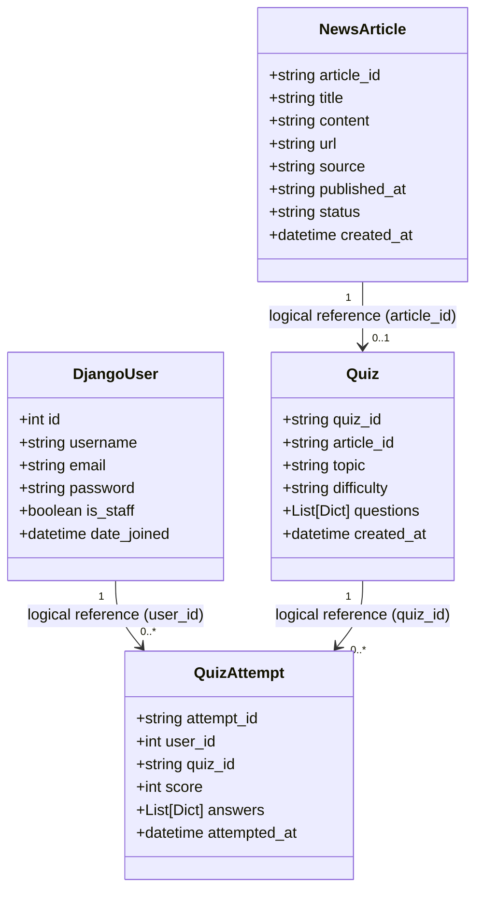

# Data Model Design Documentation

The Quiz Platform utilizes a **hybrid database architecture** to combine the strength of relational databases for session/user management and NoSQL databases for unstructured, highly flexible AI and quiz data.

---

## 1. Architecture Overview



* **Relational Database (SQLite)**: Stores users, user privileges, sessions, and authentication keys.
* **NoSQL Database (MongoDB)**: Stores scraped news articles, dynamically generated NLP quizzes, and user quiz submission histories.
* **Cross-Database Joins**: Handled programmatically at the application layer (e.g. mapping Django auth users to MongoDB quiz attempts using the numeric user ID).

---

## 2. Relational Schema (SQLite via Django ORM)

Django uses its built-in `auth` schema for user profiles and JWT token issue. 

### Table: `auth_user`
Managed by Django Auth module. Holds accounts for login and dashboards.

| Field | Type | Attributes | Description |
| :--- | :--- | :--- | :--- |
| `id` | INTEGER | PRIMARY KEY, AUTOINCREMENT | Unique identifier for the user. |
| `username` | VARCHAR(150) | UNIQUE, NOT NULL | Unique display name. |
| `email` | VARCHAR(254) | NOT NULL | User contact email address. |
| `password` | VARCHAR(128) | NOT NULL | Salted PBKDF2 password hash. |
| `is_staff` | BOOLEAN | NOT NULL (Default: False) | Grants Django Admin dashboard access. |
| `is_active` | BOOLEAN | NOT NULL (Default: True) | User account active state. |
| `date_joined` | DATETIME | NOT NULL | Timestamp of account registration. |

---

## 3. NoSQL Schema (MongoDB via MongoEngine / Motor)

All quiz and NLP models are stored in MongoDB as flexible, nested documents.

### Collection: `news_articles`
Stores raw news articles pulled from external APIs before NLP analysis.

* **MongoEngine Model**: `NewsArticle` ([dashboard/models.py](django_backend/dashboard/models.py#L4-L13))
* **Collection Name**: `news_articles`

| Field | MongoEngine Type | Key | Description |
| :--- | :--- | :--- | :--- |
| `_id` | `ObjectId` | Primary Key | MongoDB internal unique ID. |
| `article_id` | `StringField` | Unique, Required | UUID string generated by the ingestion app. |
| `title` | `StringField` | - | Headlines/Title of the article. |
| `content` | `StringField` | - | Raw text body of the article. |
| `url` | `StringField` | Unique | Direct link to the source (prevents duplicates). |
| `source` | `StringField` | - | Scraping source (e.g. `NewsAPI`, `GNews`). |
| `published_at` | `StringField` | - | Date/time published. |
| `status` | `StringField` | - | Lifecycle status: `pending`, `processed`, `failed`. |
| `created_at` | `DateTimeField` | Default: `utcnow` | Timestamp of ingestion. |

---

### Collection: `quizzes`
Stores NLP-generated quizzes, including questions, options, and correct answers.

* **MongoEngine Model**: `Quiz` ([dashboard/models.py](django_backend/dashboard/models.py#L15-L22))
* **Collection Name**: `quizzes`

| Field | MongoEngine Type | Key | Description |
| :--- | :--- | :--- | :--- |
| `_id` | `ObjectId` | Primary Key | MongoDB internal unique ID. |
| `quiz_id` | `StringField` | Unique, Required | Generated UUID of the quiz. |
| `article_id` | `StringField` | Logical Foreign Key | References `NewsArticle.article_id`. |
| `topic` | `StringField` | - | Extracted NLP keyword topic (e.g., Technology). |
| `difficulty` | `StringField` | - | Computed difficulty level: `easy`, `medium`, `hard`. |
| `questions` | `ListField(DictField)` | - | List of question dictionaries. |
| `created_at` | `DateTimeField` | Default: `utcnow` | Timestamp of quiz creation. |

#### Nested Structure: `questions`
Each item in the `questions` array is a dictionary containing:
```json
{
  "question_text": "What is the capital of France?",
  "options": ["London", "Berlin", "Paris", "Rome"],
  "correct_answer": "Paris"
}
```

---

### Collection: `quiz_attempts`
Records user quiz submissions and score statistics.

* **MongoEngine Model**: `QuizAttempt` ([dashboard/models.py](django_backend/dashboard/models.py#L24-L31))
* **Collection Name**: `quiz_attempts`

| Field | MongoEngine Type | Key | Description |
| :--- | :--- | :--- | :--- |
| `_id` | `ObjectId` | Primary Key | MongoDB internal unique ID. |
| `attempt_id` | `StringField` | Unique, Required | Generated UUID of the submission. |
| `user_id` | `IntField` | Logical Foreign Key | **References SQLite user ID (`auth_user.id`)**. |
| `quiz_id` | `StringField` | Logical Foreign Key | References `Quiz.quiz_id`. |
| `score` | `IntField` | - | Final score achieved (e.g., 0-100). |
| `answers` | `ListField(DictField)` | - | List of question responses. |
| `attempted_at` | `DateTimeField` | Default: `utcnow` | Submission timestamp. |

#### Nested Structure: `answers`
Each dictionary in the `answers` array records user responses:
```json
{
  "question_index": 0,
  "selected_option": "Paris",
  "is_correct": true
}
```
