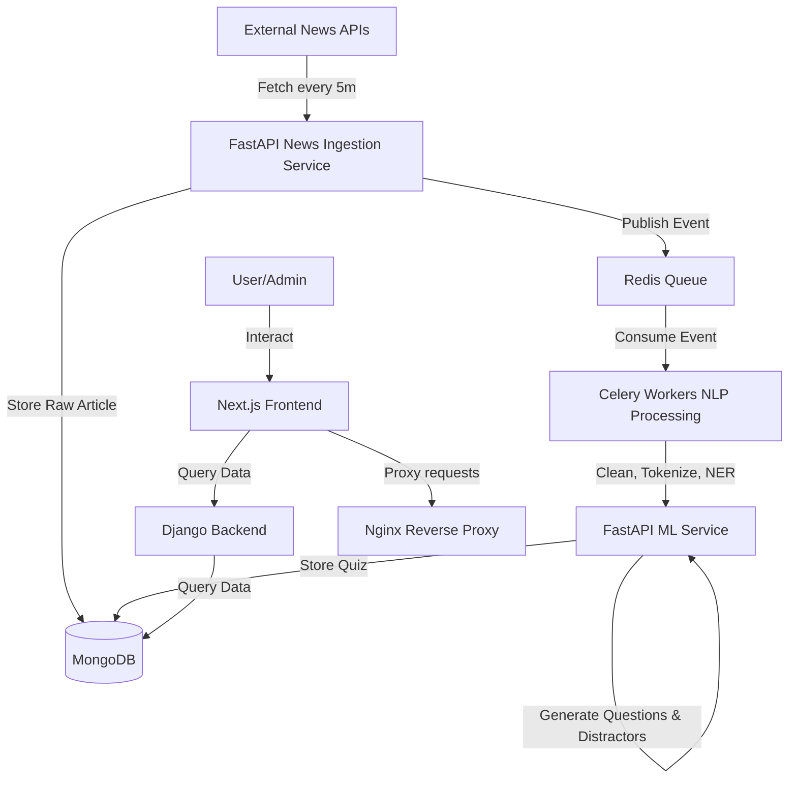

# NLP Quiz AI: Real-Time Quiz Generation from Live News

NLP Quiz AI is a production-grade, real-time platform that automatically ingests global news articles, processes them through an NLP pipeline (spaCy, BERT, T5), and generates multiple-choice quizzes to test users' knowledge. 

The application uses a microservices architecture composed of a **Next.js Frontend**, a **Django Auth & Dashboard Backend**, and a **FastAPI AI/Ingestion Service** supported by **MongoDB**, **Redis**, and **Celery**.

---

## 🚀 Live Deployment

The entire application is fully deployed on **AWS EC2** (Ubuntu 24.04) using Docker Compose, Nginx, and Let's Encrypt SSL.

* **Production URL**: [https://quizapp.space/](https://quizapp.space/)
* **Django Admin Portal**: [https://quizapp.space/admin/](https://quizapp.space/admin/)

---

## 🛠️ System Architecture & Data Flow



* **Next.js Frontend** (Port 3000): Serves the user interface (Zustand, TailwindCSS).
* **Django Backend** (Port 8000): Manages user accounts, JWT authentication, statistics, and leaderboard records.
* **FastAPI Service** (Port 8001): Performs async news fetching and triggers ML pipelines.
* **Celery Worker & Beat**: Consumes tasks from Redis to clean articles, run Entity Recognition (spaCy), extract answers (BERT), and generate questions (T5).
* **MongoDB**: Serves as the primary database for raw news articles, generated quizzes, and user attempts.
* **Redis**: Used as a Celery message broker and result backend.
* **Nginx**: Operates as a reverse proxy, serving Django static/media files directly, handling SSL termination, and routing requests dynamically.

---

## ⚙️ Local Development Setup

### Prerequisites
* Docker and Docker Compose installed.
* Python 3.10+ (if running bare-metal).
* Node.js 18+ (if running frontend bare-metal).

### Step 1: Clone and Configure Environment
Clone the repository:
```bash
git clone https://github.com/kartik4u2002/QuizApp.git
cd QuizApp
```

Create a `.env` file in the root directory:
```env
# MongoDB Connection
MONGO_URI=mongodb://mongodb:27017/nlp_quiz_db

# Redis Connection
REDIS_URL=redis://redis:6379/0

# Django Configuration
DJANGO_SECRET_KEY=dev-secret-key-change-me
DJANGO_DEBUG=True

# External API Keys (Optional for Dev, required for live news ingestion)
NEWSAPI_KEY=your_newsapi_key
GNEWS_API_KEY=your_gnews_api_key
HF_API_KEY=your_huggingface_api_key
```

### Step 2: Spin Up the Stack
Run Docker Compose:
```bash
docker compose up --build
```
This spins up MongoDB, Redis, Django, FastAPI, Celery, and Nginx.

### Step 3: Create a Django Superuser
To access the admin portal at `/admin/`:
```bash
docker compose exec django_backend python manage.py createsuperuser
```

---

## 📦 Production Maintenance & Scripts

Our production deployment includes utility scripts to ensure smooth operations:

* **[deploy.sh](deploy.sh)**: Pulls the latest code, sets up dynamic Let's Encrypt SSL certificates using Certbot standalone, configures Nginx, spins up/rebuilds Docker containers, runs Django migrations, compiles static assets, registers systemd, and configures cron renewal.
* **[rollback.sh](rollback.sh)**: Reverts the Git repository to the previous commit or a target commit/tag, rebuilds the Docker stack, and runs verification health checks.
* **[backup.sh](backup.sh)**: Automatically performs daily compressed backups of MongoDB and Django's SQLite database, enforcing a 7-day retention cleanup policy.
* **[quiz-platform.service](quiz-platform.service)**: Integrates Docker Compose with Ubuntu's systemd daemon to handle auto-startup on boot and clean shutdown.

For detailed server management, see the [AWS EC2 Deployment Guide](docs/aws_deployment_guide.md).
