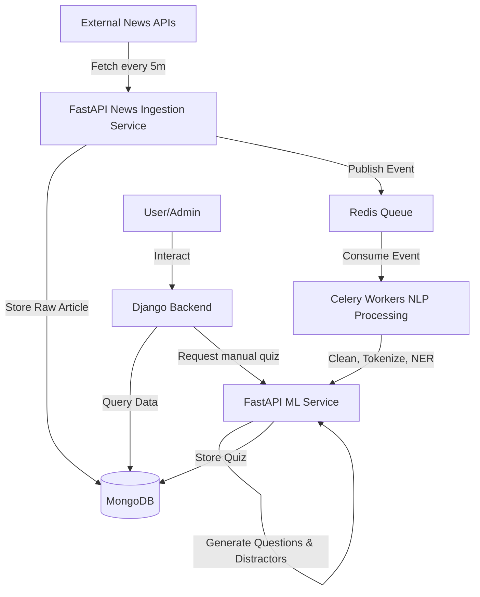

# Real-Time NLP Quiz Generation System

The goal is to build a production-grade, real-time system that ingests news articles, processes them using NLP (HuggingFace Transformers, spaCy), and automatically generates multiple-choice quizzes. The system will use a microservices architecture with Django (Admin/Dashboard/Auth) and FastAPI (AI/News Ingestion), supported by MongoDB, Redis, and Celery.

## User Review Required

> [!IMPORTANT]
> Please review the proposed microservice architecture and the tech stack choices. Specifically, note that we will use Django as the primary auth and admin portal, and FastAPI purely for AI and news ingestion pipelines.

## Open Questions

> [!WARNING]
> 1. Do you have API keys for NewsAPI and GNews ready to provide as environment variables?
> 2. What specific HuggingFace model variants would you like for BERT (e.g., `bert-base-uncased`) and T5 (e.g., `t5-small` vs `t5-base` - note that larger models require more RAM)?
> 3. Should the Django frontend be purely templates, or should it just serve REST/GraphQL APIs for a separate SPA (like React/Vue)? (I will build basic Django templates for the dashboard unless specified otherwise).

## Architecture & Data Flow

## Database Design (MongoDB Schema)

### 1. `users` (Managed via Django Auth + Djongo/MongoEngine or custom integration)
- id, username, email, password, role (admin/user), created_at

### 2. `news_articles`
- `article_id` (UUID)
- `title` (String)
- `content` (String)
- `source` (String - NewsAPI/GNews/RSS)
- `url` (String - unique to prevent duplicates)
- `published_at` (Datetime)
- `status` (Enum: pending, processed, failed)

### 3. `quizzes`
- `quiz_id` (UUID)
- `article_id` (UUID, ref `news_articles`)
- `topic` (String)
- `difficulty` (String: easy/medium/hard)
- `questions` (Array of Objects)
  - `question_text` (String)
  - `options` (Array of Strings - 4 items)
  - `correct_answer` (String)
- `created_at` (Datetime)

### 4. `quiz_attempts`
- `attempt_id` (UUID)
- `user_id` (UUID, ref `users`)
- `quiz_id` (UUID, ref `quizzes`)
- `score` (Integer)
- `answers` (Array of Objects)
- `attempted_at` (Datetime)

## Proposed Project Structure

We will use a monolithic repository with separate directories for each service, making it easy to orchestrate with `docker-compose`.

### 1. `docker/` and Root
- `docker-compose.yml` (Redis, MongoDB, Services)
- `nginx/nginx.conf`
- `.env`

### 2. `django_backend/`
- `manage.py`
- `core/` (Settings, WSGI, ASGI)
- `users/` (Auth, Profiles)
- `dashboard/` (Analytics, Leaderboard)
- `Dockerfile`
- `requirements.txt`

### 3. `fastapi_services/`
- `main.py`
- `api/`
  - `news.py` (News Ingestion APIs)
  - `quiz.py` (Quiz Generation APIs)
- `core/` (Config, DB connection)
- `services/`
  - `news_fetcher.py` (Async requests to external APIs)
- `worker/` (Celery Tasks)
  - `celery_app.py`
  - `tasks.py`
- `Dockerfile`
- `requirements.txt`

### 4. `ml_models/` (Python package imported by FastAPI/Celery)
- `nlp_pipeline.py` (spaCy cleaning, NER, tokenization)
- `quiz_engine.py` (BERT answer extraction, T5 question generation, Distractors)
- `models/` (Downloaded weights / Cache dir)

## API Implementation Plan

### FastAPI Endpoints:
- `GET /api/v1/news/latest`: Retrieve latest ingested news.
- `GET /api/v1/quizzes/latest`: Retrieve latest generated quizzes.
- `GET /api/v1/quizzes/topic/{topic}`: Filter quizzes by topic.
- `POST /api/v1/generate-quiz`: Trigger immediate quiz generation for an article (manual mode).

### Django Endpoints/Views:
- Authentication Views (JWT/Session).
- Admin Dashboard Views.
- Quiz History & Analytics.
- `POST /quiz/submit`: Evaluate a user's quiz attempt and update leaderboard.

## Verification Plan

### Automated/Unit Tests
- FastApi tests using `TestClient` for the `generate-quiz` and `news/latest` endpoints.
- Mock external news API responses to test the ingestion logic without hitting rate limits.
- NLP pipeline dummy text tests to ensure T5/BERT output correct formats (question + 4 options).

### Manual Verification
- Bring up the stack using `docker-compose up`.
- Access the Django admin at `localhost/admin` (via Nginx).
- Trigger a Celery task manually to fetch news and watch the logs for successful NLP processing.
- Verify MongoDB `quizzes` collection gets populated with valid JSON objects.
