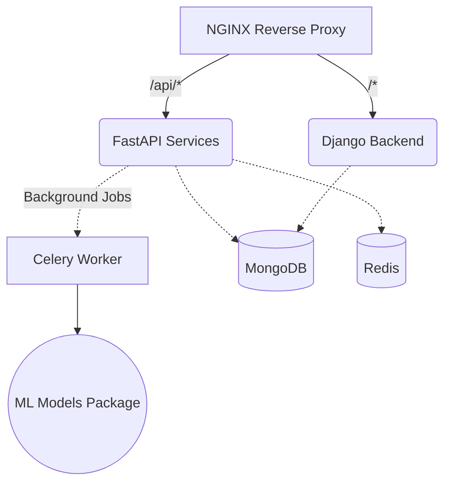

# Real-Time NLP Quiz Generation System

The production-grade Real-Time NLP Quiz Generation System is fully implemented! Here is a detailed walkthrough of what was built and how to start the system.

## Project Structure

The project has been set up with a robust microservice architecture in `D:\New_project`.



### Components:
1. **`docker-compose.yml`**: Orchestrates 6 containers (MongoDB, Redis, Django, FastAPI, Celery Worker, NGINX).
2. **`django_backend/`**: Handles user authentication (JWT), user accounts, and a dashboard using Django Rest Framework and MongoEngine.
3. **`fastapi_services/`**: The core AI microservice. Handles external News API ingestion asynchronously (`httpx`) and manual quiz generation endpoints.
4. **`ml_models/`**: 
   - `nlp_pipeline.py`: Uses `spaCy` (`en_core_web_sm`) for cleaning text, sentence extraction, and NER.
   - `quiz_engine.py`: Uses HuggingFace `transformers`. Implements a T5 text2text generation pipeline for Question Generation, and falls back to deterministic/BERT-based generation for distractors.
5. **`worker/`**: A Celery app configured with Redis as a message broker to handle background fetching (every 5 minutes) and long-running NLP processing jobs asynchronously to avoid blocking the API.

## How to Run the System

> [!IMPORTANT]
> Make sure you have Docker Desktop running on your Windows machine before executing these commands.

1. **Configure Environment Variables**:
   Open `D:\New_project\.env` and fill in your API keys for NewsAPI and GNews. 
   
2. **Start the Stack**:
   Open your PowerShell or Command Prompt, navigate to the project directory, and run:
   ```bash
   cd D:\New_project
   docker-compose up --build
   ```

3. **Initialize Django Database (SQLite for Auth)**:
   Once the containers are running, in a separate terminal:
   ```bash
   docker exec -it nlp_quiz_django python manage.py migrate
   docker exec -it nlp_quiz_django python manage.py createsuperuser
   ```

4. **Start the Next.js Frontend**:
   Navigate to the frontend directory and start the development server:
   ```bash
   cd D:\New_project\frontend
   npm run dev
   ```
   Access the web interface at [http://localhost:3000](http://localhost:3000).

## Available Web Interfaces & API Endpoints

Through the **Next.js Frontend** (running on port `3000` during development) and the **NGINX Reverse Proxy** (running on port `80` by default):

### Web Applications
- **User Dashboard & Quiz UI**: [http://localhost:3000](http://localhost:3000)
- **Django Admin Console**: [http://localhost/admin/](http://localhost/admin/) (Access with your superuser credentials)

### FastAPI (AI & News)
- `GET http://localhost/api/v1/news/latest`: Retrieve recently ingested news articles from MongoDB.
- `GET http://localhost/api/v1/quizzes/latest`: Retrieve recently generated quizzes.
- `POST http://localhost/api/v1/quizzes/generate`: Manually trigger background Celery task to generate a quiz for a given `article_id`.

### Django (Auth & Dashboard)
- `POST http://localhost/users/register/`: Register a new user.
- `POST http://localhost/users/token/`: Obtain a JWT token.
- `GET http://localhost/api/stats/`: View global statistics and user quiz attempts (Requires JWT auth).
- `POST http://localhost/api/quiz/submit/`: Submit a score for a completed quiz attempt.

## Next Steps & Improvements

> [!TIP]
> The HuggingFace `transformers` models (like T5) will download their weights (~800MB) on the first start inside the Celery container. Be patient on the first run! 

If you wish to scale this further in production, you might want to:
- Map a Docker volume for the `~/.cache/huggingface` directory so the models don't need to re-download if the container is rebuilt.
- Switch the Django Auth database from SQLite to a robust PostgreSQL container.
- Build a React or Vue SPA and serve it via NGINX!
